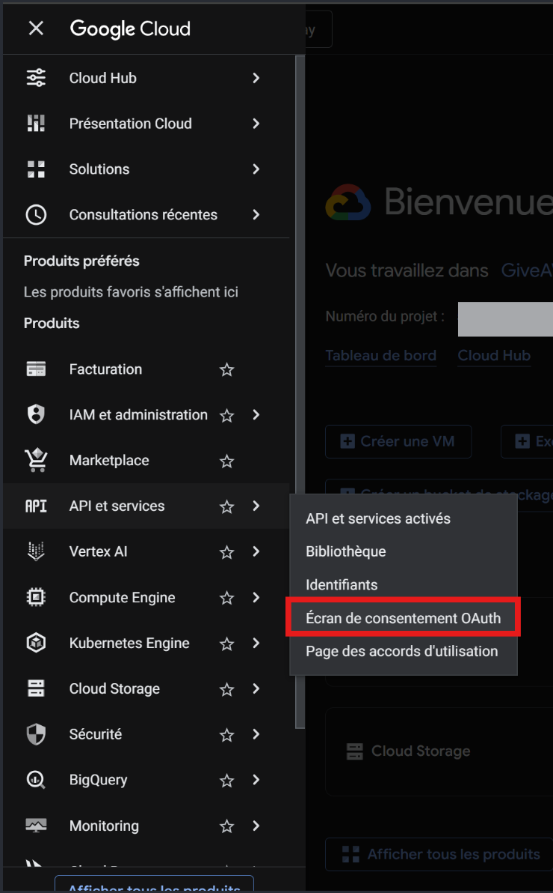
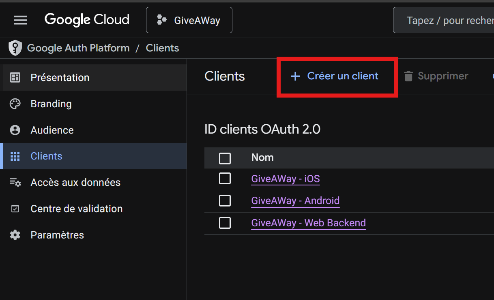

# 🔐 Configuration Google OAuth - GiveAWay

Ce document explique comment configurer l'authentification Google pour
les trois plateformes (Web, Android, iOS).

---

## Prérequis

- Un compte [Google Cloud Console](https://console.cloud.google.com)
- Un compte [Expo](https://expo.dev) - créer un compte gratuit si besoin
- EAS CLI installé : `npm install -g eas-cli`
- Être invité sur l'organisation Expo **giveaway-team** (demander à @mart1ndev)

---

## Étape 1 - Google Cloud Console

### 1.1 Créer un projet

1. Aller sur [console.cloud.google.com](https://console.cloud.google.com)
2. Créer un nouveau projet ou utiliser le projet GiveAWay existant
3. Activer l'**API Google+ / People API** si demandé

### 1.2 Écran de consentement OAuth

1. Menu → **APIs & Services** → **Écran de consentement OAuth**
2. Type d'utilisateur : **Externe**
3. Remplir le nom de l'app (`GiveAWay`), l'email de support
4. Sauvegarder

> 💡 Les scopes `openid`, `email` et `profile` sont normalement activés par défaut,
> aucune configuration supplémentaire n'est nécessaire.





### 1.3 Créer les clients OAuth (Menu → Clients)
Obtenir les Client IDs pour les trois plateformes

#### Client Web

| Champ                          | Valeur                                              |
| ------------------------------ | --------------------------------------------------- |
| Type                           | Application Web                                     |
| Nom                            | `GiveAWay Web`                                      |
| Origines JavaScript autorisées | `http://localhost:8081`                             |
| URIs de redirection autorisés  | `http://localhost:8081`                             |
| URIs de redirection autorisés  | `https://auth.expo.io/@giveaway-team/mobile`        |

> [!NOTE]
> L'URI de redirection `https://auth.expo.io/@giveaway-team/mobile` est liée à
> l'organisation Expo **giveaway-team**. Ne pas modifier cette valeur.

#### Client Android

| Champ           | Valeur                                |
| --------------- | ------------------------------------- |
| Type            | Android                               |
| Nom             | `GiveAWay Android`                    |
| Nom du package  | `com.googleoauth`                     |
| Empreinte SHA-1 | *(voir section 2 - Générer le SHA-1)* |

#### Client iOS

| Champ        | Valeur            |
| ------------ | ----------------- |
| Type         | iOS               |
| Nom          | `GiveAWay iOS`    |
| ID du bundle | `com.googleoauth` |

---

## Étape 2 - Générer l'empreinte SHA-1 (Android)

L'empreinte SHA-1 est nécessaire pour le client Android.
Elle est liée à ton compte Expo - chaque développeur doit générer la sienne.
```bash
# Se connecter à Expo avec ton compte personnel
eas login

# Générer les credentials Android (crée automatiquement le keystore et le SHA-1)
eas credentials --platform android
```

Copie le SHA-1 affiché et colle-le dans le client Android de Google Console.

---

## Étape 3 - Firebase (google-services.json)

Le fichier `google-services.json` n'est **pas commité** dans le repo (données sensibles).
Il doit être téléchargé depuis Firebase Console par chaque développeur.

1. Aller sur [console.firebase.google.com](https://console.firebase.google.com)
2. Sélectionner le projet GiveAWay (lié au même projet Google Cloud)
3. **Paramètres du projet** (⚙️) → **Général** → section **Vos applications**
4. Sélectionner l'app Android → **Ajouter une empreinte** → coller ton SHA-1
5. Télécharger `google-services.json`
6. Placer le fichier dans `apps/mobile/google-services.json`

---

## Étape 4 - Variables d'environnement

### Backend (`/.env` à la racine)
```dotenv
GOOGLE_CLIENT_WEB_ID=<web_client_id>
GOOGLE_IOS_CLIENT_ID=<ios_client_id>
GOOGLE_ANDROID_CLIENT_ID=<android_client_id>
```

### Frontend (`/apps/mobile/.env`)
```dotenv
# URL de l'API backend
# - Développement web          : http://localhost:3000
# - Développement mobile (LAN) : http://192.168.x.x:3000
#   → Remplace x.x par l'IP locale de ta machine (ipconfig sur Windows, ifconfig sur Mac/Linux)
#   → Ton téléphone et ton PC doivent être sur le même réseau WiFi
# - Production                 : https://api.ton-domaine.com
EXPO_PUBLIC_API_URL=

EXPO_PUBLIC_GOOGLE_WEB_CLIENT_ID=<web_client_id>
EXPO_PUBLIC_GOOGLE_ANDROID_CLIENT_ID=<android_client_id>
EXPO_PUBLIC_GOOGLE_IOS_CLIENT_ID=<ios_client_id>
```

---

## Étape 5 - Configuration `app.json`

Le fichier `app.json` est déjà configuré pour l'organisation **giveaway-team**.
**Ne pas modifier ces valeurs.**
```json
{
  "expo": {
    "owner": "giveaway-team",
    "extra": {
      "eas": {
        "projectId": "8ec15cbb-f3af-4dbe-ae4b-48c7bea59faf"
      }
    },
    "plugins": [
      [
        "@react-native-google-signin/google-signin",
        {
          "iosUrlScheme": "com.googleusercontent.apps.<ios_client_id_sans_suffix>"
        }
      ]
    ]
  }
}
```

L'`iosUrlScheme` est le Client ID iOS **inversé** :
- Client ID iOS : `533720849177-xxx.apps.googleusercontent.com`
- iosUrlScheme : `com.googleusercontent.apps.533720849177-xxx`

---

## Étape 6 - Builder l'app Android pour les tests

> [!WARNING]
> Le development build est nécessaire pour tester *Google Auth* sur mobile.
> Expo Go ne supporte pas les schemes custom utilisés par Google OAuth.

### 6.1 Se connecter à Expo
```bash
eas login
# Se connecter avec ton compte Expo personnel
# Tu dois avoir accepté l'invitation de l'organisation giveaway-team
```

### 6.2 Uploader le google-services.json sur EAS
⚠️ Pour l'organisation giveaway-team, cela a déjà été fait pas besoin de la recréer.
Le fichier `google-services.json` doit être uploadé comme variable secrète
sur EAS pour être disponible lors du build cloud :
```bash
cd apps/mobile
eas env:create
# Répondre aux questions :
# - Name        : GOOGLE_SERVICES_JSON
# - Type        : file
# - Value       : chemin vers ./google-services.json
# - Visibility  : secret
# - Environment : development (et preview, production)
```

> [!NOTE]
> Cette étape est à faire une seule fois par projet.
> Si la variable existe déjà, passe directement à l'étape 6.3.

### 6.3 Lancer le build
```bash
cd apps/mobile
eas build --profile development --platform android
```

- Le build se fait dans le cloud (~15 min sur le plan gratuit)
- Un QR code apparaît à la fin - scanne-le avec ton téléphone pour télécharger l'APK
- Installe l'APK sur ton téléphone Android

### 6.4 Lancer le serveur de développement
```bash
# Dans un terminal - Backend
npm run dev --workspace=apps/api

# Dans un autre terminal - Frontend
cd apps/mobile
npx expo start --dev-client --host lan
```

Ouvre l'app installée sur ton téléphone, connecte-toi au compte Expo puis scanne
le QR code affiché dans le terminal ou entre manuellement l'URL
`http://192.168.x.x:8081` dans le champ de l'app.

---

## Récapitulatif des fichiers sensibles

| Fichier                | Commité ? | Où le récupérer                  |
| ---------------------- | --------- | -------------------------------- |
| `google-services.json` | ❌ Non     | Firebase Console                 |
| `/.env`                | ❌ Non     | Google Cloud Console + collègues |
| `/apps/mobile/.env`    | ❌ Non     | Google Cloud Console + collègues |
| `app.json`             | ✅ Oui     | Dans le repo                     |
| `eas.json`             | ✅ Oui     | Dans le repo                     |

---

## En résumé pour un nouveau développeur
```bash
# 1. Cloner le repo
git clone <repo>

# 2. Installer les dépendances
npm install

# 3. Copier et remplir les .env
cp .env.example .env
cp apps/mobile/.env.example apps/mobile/.env
# → Remplir les valeurs avec les IDs Google et l'URL API

# 4. Récupérer google-services.json depuis Firebase Console
# → Placer dans apps/mobile/google-services.json

# 5. Se connecter à Expo (accepter l'invitation giveaway-team au préalable)
eas login
cd apps/mobile && eas build --profile development --platform android

# 6. Lancer le projet
# Dans un terminal - Backend
npm run dev --workspace=apps/api

# Dans un autre terminal - Frontend
cd apps/mobile
npx expo start --dev-client --host lan
```