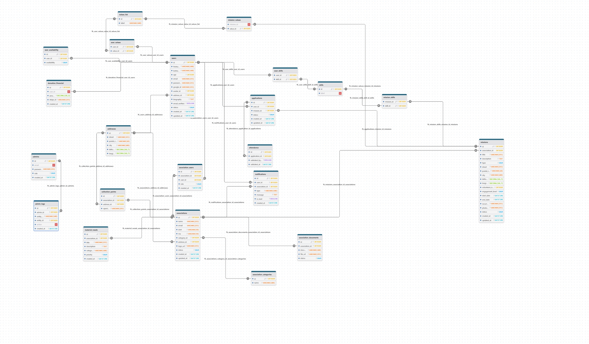

# 🤝 Giveaway

> **Connecter ceux qui veulent aider avec ceux qui en ont besoin.**


[](https://sonarcloud.io/summary/new_code?id=Mart1n-S_GiveAWay)

---

## 📖 À propos

**Giveaway** est une plateforme innovante de mise en relation entre bénévoles et associations. Notre mission est de simplifier l'engagement associatif grâce à la technologie.

L'application repose sur un **algorithme de matching intelligent** qui propose des missions personnalisées en fonction de la localisation et des centres d'intérêt du bénévole, à la manière des applications de rencontre, mais pour la bonne cause.

### ✨ Fonctionnalités Clés (MVP)

- 🎯 **Matching Intelligent :** Algorithme de pertinence (Géolocalisation + Tags).
- 📱 **Expérience Mobile First :** Application fluide et intuitive (Expo / React Native).
- 🏢 **Espace Association :** Publication de missions et vérification d'identité (RNA).
- 🔒 **Architecture Sécurisée :** Séparation stricte Client/Serveur et base de données isolée.

---

## 🛠️ Stack Technique

Ce projet est conçu comme un **Monorepo** orchestré par **Turborepo**, garantissant une cohérence totale entre le Frontend et le Backend (partage de types TypeScript).

| Domaine          | Technologie             | Usage                                             |
| :--------------- | :---------------------- | :------------------------------------------------ |
| **Monorepo**     | **Turborepo**           | Orchestration du build et cache intelligent.      |
| **Langage**      | **TypeScript**          | Typage strict partagé (End-to-End Type Safety).   |
| **Mobile & Web** | **Expo (React Native)** | Application Cross-platform (iOS, Android, Web).   |
| **Routing**      | **Expo Router**         | Navigation basée sur les fichiers.                |
| **UI Framework** | **NativeWind (v4)**     | Styles utilitaires basés sur Tailwind CSS.        |
| **Forms**        | **React Hook Form**     | Gestion performante des formulaires & validation. |
| **Backend**      | **NestJS**              | Framework Node.js modulaire et robuste.           |
| **Data**         | **PostgreSQL + Prisma** | Base de données relationnelle et ORM moderne.     |
| **Infra (Dev)**  | **Docker**              | Conteneurisation de la BDD et outils d'admin.     |

---

## 📂 Structure du Projet

```text
Giveaway/
├── apps/
│   ├── api/          # Backend NestJS (Port 3000)
│   └── mobile/       # Application Expo iOS/Android/Web
│       ├── app/      # Navigation & Pages (Expo Router)
│       └── src/
│           ├── components/ # Design System & Wrappers de formulaires
│           ├── services/   # Appels API
│           └── stores/     # État global (Zustand)
├── packages/
│   └── shared/       # DTOs, Types et Interfaces partagés (Back & Front)
└── docker-compose.yml # Infrastructure locale (Postgres, Adminer)

```

---

## 🎨 Design System

L'interface utilisateur repose sur une bibliothèque de composants locale située dans `apps/mobile/src/components/ui`. Elle garantit une cohérence visuelle parfaite sur mobile et web.

Nous disposons actuellement de composants fondamentaux déclinés en plusieurs variantes et états (Hover, Active, Loading, Disabled, Error...) :

1. **Button :** Boutons primaires, secondaires, tertiaires avec gestion d'icônes et spinner de chargement.
2. **Input :** Champs de saisie avec icônes (gauche/droite), textes d'aide et validation d'erreurs.
3. **TextArea :** Zones de texte multi-lignes auto-extensibles avec compteurs de caractères.
4. **AppShell :** Structure globale gérant la navigation responsive (NavBar Web / Tabs Mobile).

### 🕹️ Documentation Interactive (Playground)

Une page "Design System" est intégrée à l'application. Elle est **accessible uniquement en mode développement** via le menu de navigation et permet de visualiser tous les composants en temps réel.

🔗 **Accès Web :** [http://localhost:8081/design-system](http://localhost:8081/design-system)

---

# 🚀 Démarrage Rapide

## 📦 Prérequis

- **Node.js** (v20+)
- **Docker** & **Docker Compose**

---

## 🛠️ Installation

### 1️⃣ Cloner le projet

```bash
git clone https://github.com/Mart1n-S/GiveAWay.git
cd GiveAWay
```

---

### 2️⃣ Copier le fichier .env.example en .env et remplir les valeurs appropriées.

```bash
cp .env.example .env
```

Pour le `JWT_ACCESS_SECRET` et `JWT_REFRESH_SECRET`, générer des clés secrètes sécurisées différentes en utilisant la commande suivante 2 fois :

```bash
openssl rand -base64 62
```

### 💾 Stockage des fichiers (Images)

Le projet supporte deux modes de stockage pour les avatars et images :

- **Mode Local** (Recommandé pour le Dev) : Les images sont stockées dans le dossier `apps/api/uploads` et servies directement par l'API.

```bash
STORAGE_TYPE=local

```

- **Mode Cloudinary** (Recommandé pour la Prod) : Les images sont hébergées sur les serveurs de Cloudinary (CDN).

```bash
STORAGE_TYPE=cloudinary

CLOUDINARY_CLOUD_NAME=votre_cloud_name
CLOUDINARY_API_KEY=votre_api_key
CLOUDINARY_API_SECRET=votre_api_secret

```

_Si vous utilisez le mode local, vous pouvez laisser les variables Cloudinary vides._

---

### 3️⃣ Installer les dépendances

```bash
npm install
```

---

### 4️⃣ Prisma – Génération du client

```bash
npm run prisma:generate
```

---

### 5️⃣ Démarrer le développement

```bash
npm run dev
```

---

## 🧪 Tests Backend (Jest)

A la racine du projet, exécuter les commandes suivantes pour lancer les tests unitaires et d'intégration sur l'ensemble des applications et packages :

```bash
npm run test
```

```bash
npm run test:e2e
```

## 📱 Tests Frontend & Mobile Web (Playwright)

Les tests Playwright simulent le parcours utilisateur complet dans un navigateur. Ils nécessitent que le Backend et le Frontend tournent en **Mode Test**.

#### 1. Préparation (Une seule fois)

Assurez-vous que la base de données de test est synchronisée :

```bash
npm run db:test:setup

```

#### 2. Lancement des services

Vous devez ouvrir deux terminaux pour faire tourner les applications :

- **Terminal A (API en mode test) :** `npm run start:test --workspace=apps/api`
- **Terminal B (Web) :** `npm run web --workspace=apps/mobile`

#### 3. Exécution des tests Playwright

Une fois les services démarrés, lancez les tests depuis la racine :

| Commande                        | Description                                                   |
| ------------------------------- | ------------------------------------------------------------- |
| `npm run test:e2e:mobile:ui`    | **Recommandé** : Ouvre l'interface interactive de Playwright. |
| `npm run test:e2e:mobile`       | Lance tous les tests en mode "headless" (console).            |
| `npm run test:e2e:mobile:debug` | Lance les tests pas à pas pour le débogage.                   |

> [!IMPORTANT]
> Ne lancez pas les tests e2e sur le serveur de développement standard (`npm run dev`).

---

### 💡 Astuces

Pour lancer un fichier de test spécifique :

```bash
npm run test:e2e:mobile -- inscription-benevole.spec.ts
```

---

## 🌐 Accès aux services

### 🚀 API (NestJS)

[http://localhost:3000](http://localhost:3000)

### 📱 Mobile (Expo)

Scannez le **QR Code affiché dans le terminal** avec **Expo Go** (iOS/Android)

### 🖥️ Web (Expo)

[http://localhost:8081/](http://localhost:8081/)

---

# Schéma prévisionnel de la BDD


