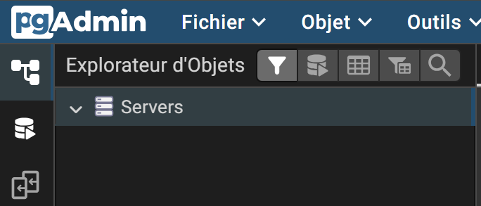
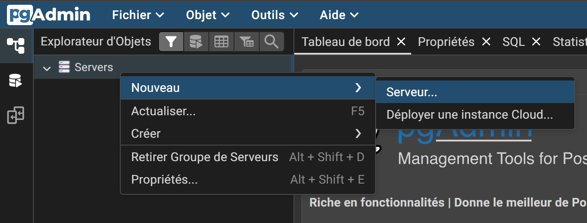
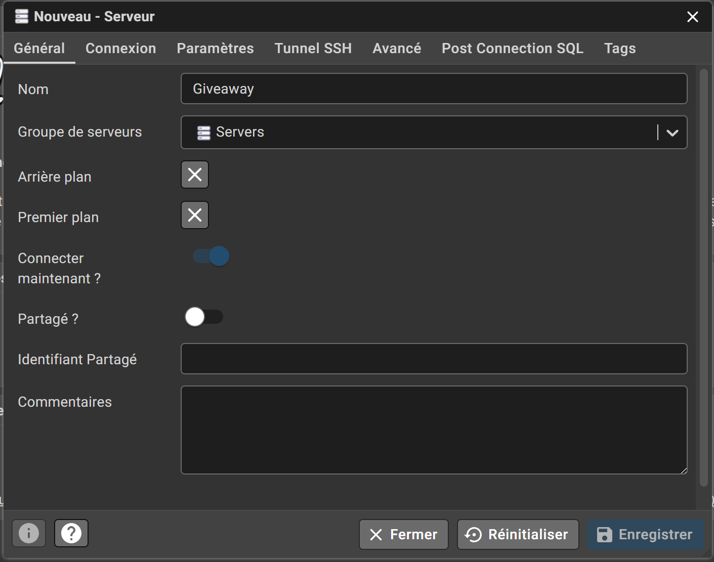
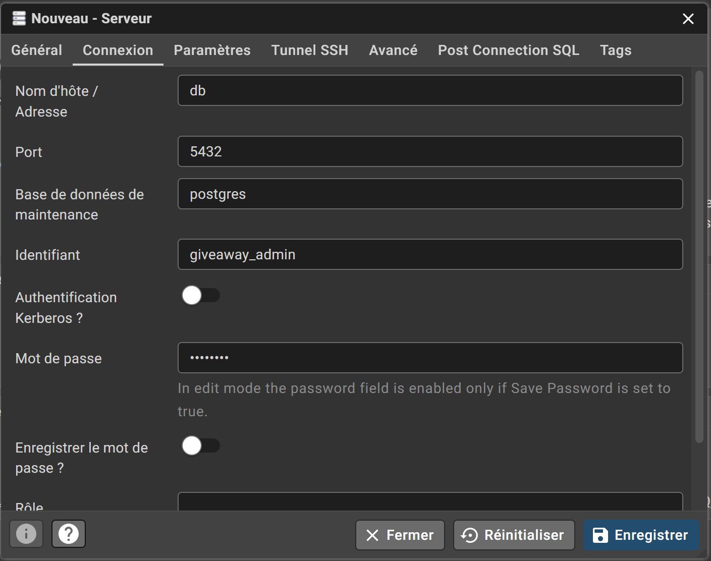

# 🗄️ Gestion de la Base de Données (Prisma & Docker)

Ce projet utilise **Prisma** avec une base de données **PostgreSQL** hébergée via Docker.
L'architecture est configurée pour charger automatiquement les variables d'environnement depuis la racine du monorepo (`.env`).

## 🚀 1. Pré-requis

Avant toute manipulation, assurez-vous que le conteneur Docker est lancé et tourne sur le port configuré (5434).

```bash
# À la racine du projet
docker-compose up -d

```

---

## 📝 2. Modifier la structure (Schéma)

C'est ici que vous définissez vos tables (Models), vos champs et vos relations.

* 📂 **Emplacement :** `apps/api/prisma/schema.prisma`

Une fois vos modifications enregistrées dans ce fichier, passez à l'étape suivante.

---

## 🛠️ 3. Créer et Lancer une Migration

Pour appliquer vos changements à la base de données réelle, il faut créer une "migration" (un fichier SQL généré par Prisma).

⚠️ **Important :** Les commandes doivent toujours être lancées depuis le dossier `apps/api`.

**Procédure :**

1. Ouvrez votre terminal et placez-vous dans le dossier de l'API :
```bash
cd apps/api

```


2. Lancez la commande de migration personnalisée :
```bash
npm run db:migrate -- --name nom_de_votre_modification

```


*Remplacez `nom_de_votre_modification` par un nom clair (ex: `add_user_profile`, `init_missions`).*

> **Pourquoi les tirets `--` ?**
> Ils sont obligatoires pour passer des arguments (comme le nom `--name`) à travers notre script NPM qui charge les variables d'environnement.

---

## 👁️ 4. Visualiser les Données (Prisma Studio)

Pour voir, éditer ou supprimer des données via une interface web simplifiée :

```bash
# Dans le dossier apps/api
npm run db:studio

```

L'interface s'ouvrira automatiquement.

---

C'est très clair ! Tu as tout à fait raison : puisque tu utilises le **PgAdmin fourni par Docker** (accessible via le navigateur), tu es "à l'intérieur" du réseau Docker.

Du coup :

1. L'hôte devient **`db`** (le nom du service Docker) et plus `localhost`.
2. Le port devient **`5432`** (le port interne) et plus `5434`.

Voici la section **5 mise à jour** pour ta documentation, avec les emplacements prévus pour tes screenshots.

---

## 🔌 5. Connexion via PgAdmin (Interface Web)

Cette méthode utilise l'interface PgAdmin incluse dans Docker, accessible via votre navigateur.

### A. Accès à l'interface

1. Ouvrez votre navigateur à l'adresse : [http://localhost:8080](http://localhost:8080)
2. Connectez-vous avec les identifiants définis dans le fichier `.env` :
* **Email :** (Voir `PGADMIN_DEFAULT_EMAIL` dans le .env)
* **Mot de passe :** (Voir `PGADMIN_DEFAULT_PASSWORD` dans le .env)


### B. Configuration du Serveur

Une fois connecté, suivez ces étapes pour ajouter la base de données :

**Étape 1 : Créer le serveur**
Dans la colonne de gauche (Browser), faites un **Clic Droit** sur `Servers`.



**Étape 2 : Sélectionner "Nouveau" puis "Serveur"**



**Étape 3 : Onglet "General"**
Dans la fenêtre qui s'ouvre, restez sur le premier onglet.

* **Name :** Donnez un nom au serveur (ex: `Giveaway`).




**Étape 4 : Onglet "Connexion"**
Cliquez sur l'onglet **Connexion** et remplissez les champs **exactement** comme ceci (car nous sommes à l'intérieur du réseau Docker) :

* **Host name / address :** `db`
* **Port :** `5432`
* **Maintenance database :** `giveaway`
* **Username :** (Voir `POSTGRES_USER` dans le .env, ex: `giveaway_admin`)
* **Password :** (Voir `POSTGRES_PASSWORD` dans le .env)



Cliquez sur **Save**. La connexion est établie ! 🚀

## 🆘 Résolution de problèmes courants

**Erreur : "Authentication failed" (P1000)**

* Vérifiez que Docker tourne bien.
* Assurez-vous que le port dans le `.env` racine est bien `5434`.

**Erreur : "Missing script: db:migrate"**

* Vous n'êtes pas dans le bon dossier. Faites `cd apps/api` avant de lancer la commande.